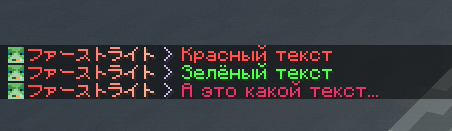
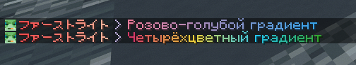
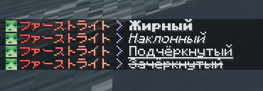

# Формат MiniMessage

## О формате

Начиная с любого доната, Вы можете оформлять цветом и стилями текст в чате и нике. 

Для форматирования текста сервер использует современный формат MiniMessage, обладающий множеством преимуществ по сравнению со старым форматом, где использовались &.

Формат основан на заключении форматируемой части текста в теги, как в HTML:

```html
<тег>Текст</тег>
```

Теги можно вкладывать друг в друга для оформления части текста внутри другой оформленной части. В конце ставится закрывающий тег, имеющий `/`, однако он обязателен только если вы хотите завершить часть текста с текущим оформлением. Например:

```
<red>Красный текст <green>зелёная часть</green> продолжение красного текста</red>
```

::: info Онлайн-редактор

Вы можете опробовать формат в онлайн-редакторе:
[webui.advntr.dev](https://webui.advntr.dev/?mode=chat_open&input=%3Cred%3E%D0%9A%D1%80%D0%B0%D1%81%D0%BD%D1%8B%D0%B9%20%D1%82%D0%B5%D0%BA%D1%81%D1%82%20%3Cgreen%3E%D0%B7%D0%B5%D0%BB%D1%91%D0%BD%D0%B0%D1%8F%20%D1%87%D0%B0%D1%81%D1%82%D1%8C%3C%2Fgreen%3E%20%D0%BF%D1%80%D0%BE%D0%B4%D0%BE%D0%BB%D0%B6%D0%B5%D0%BD%D0%B8%D0%B5%20%D0%BA%D1%80%D0%B0%D1%81%D0%BD%D0%BE%D0%B3%D0%BE%20%D1%82%D0%B5%D0%BA%D1%81%D1%82%D0%B0%3C%2Fred%3E%0A%3Cgold%3E%D0%9E%D1%80%D0%B0%D0%BD%D0%B6%D0%B5%D0%B2%D1%8B%D0%B9%3C%2Fgold%3E%0A%3Cyellow%3E%D0%96%D1%91%D0%BB%D1%82%D1%8B%D0%B9%3C%2Fyellow%3E%0D%0A%3C%23E23A6A%3E%D0%90%D0%BB%D1%8B%D0%B9%3C%2F%23E23A6A%3E%0A%3Cgradient%3A%23EE7E9E%3A%233AA6EF%3E%D0%A0%D0%BE%D0%B7%D0%BE%D0%B2%D0%BE-%D0%B3%D0%BE%D0%BB%D1%83%D0%B1%D0%BE%D0%B9%20%D0%B3%D1%80%D0%B0%D0%B4%D0%B8%D0%B5%D0%BD%D1%82%3C%2Fgradient%3E%0D%0A%3Cgradient%3A%23D93B68%3A%23EFD43A%3A%2323C6FD%3A%2334A732%3E%D0%A7%D0%B5%D1%82%D1%8B%D1%80%D1%91%D1%85%D1%86%D0%B2%D0%B5%D1%82%D0%BD%D1%8B%D0%B9%20%D0%B3%D1%80%D0%B0%D0%B4%D0%B8%D0%B5%D0%BD%D1%82%3C%2Fgradient%3E&bg=grass)

:::

## Теги

### Обычный цвет

Чтобы просто покрасить текст, можно использовать в тегах #hex-код цвета или одно из заготовленных названий.
```
<red>Красный текст</red>
<green>Зелёный текст</green>
<#E23A6A>А это какой текст...</#E23A6A>
```



::: details Стандартные названия цветов

`black`, `dark_blue`, `dark_green`, `dark_aqua`, `dark_red`, `dark_purple`, `gold`, `gray`, `dark_gray`, `blue`, `green`, `aqua`, `red`, `light_purple`, `yellow`, `white`

:::

### Градиент

Градиент делается при помощи тега `<gradient:#hex1:#hex2>Текст</gradient>`. Можно перечислять сколько угодно цветов через `:`.

```
<gradient:#EE7E9E:#3AA6EF>Розово-голубой градиент
<gradient:#D93B68:#EFD43A:#23C6FD:#34A732>Четырёхцветный градиент
```



### Стили

Вы можете делать текст **жирным**, *наклонным*, <u>подчёркнутым</u> и <st>зачёркнутым</st> при помощи следующих тегов:

```
<b>Жирный</b>
<i>Наклонный</i>
<u>Подчёркнутый</u>
<st>Зачёркнутый</st>
```



### Инструменты

- [birdflop.com](https://www.birdflop.com/resources/rgb/) - удобный редактор градиентов. Не забудьте выбрать Формат цвета MiniMessage.

- [Официальная документация по MiniMessage](https://docs.advntr.dev/minimessage/format.html) (на английском).