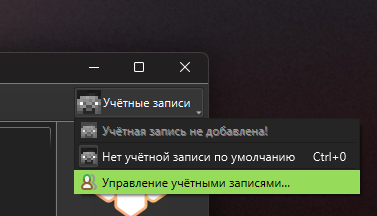

# Установка сборок

Данный гайд подходит для установки любых сборок в формате Modrinth (.mrpack), в котором в том числе сделаны все сборки OUTBREAK, а также сборок от CurseForge, Prism Launcher, PolyMC, MultiMC и Technic.

Установка осуществляется при помощи Prism Launcher. Он позволяет в пару кликов устанавливать, а также создавать сборки, имеет много полезных функций, а ещё в нём нет никакой рекламы и слежки.

## Установка Prism Launcher

=== "Пиратка"

    1. Скачайте Cracked-версию Prism Launcher [здесь в списке Assets](https://github.com/Diegiwg/PrismLauncher-Cracked/releases){:target="_blank"} (для Windows - выбирайте файл с Setup-<версия>.exe в названии) и запустите скаченный установщик.

    2. Запустите лаунчер и создайте профиль, нажав на кнопку в верхнем правом углу.

        
      
        Для создания пиратского аккаунта - нажимайте `Добавить автономную` и вводите свой ник.

    После создания аккаунта, лаунчер готов к установке сборок.

=== "Лицензия"

    1. Скачайте [Prism Launcher с официального сайта](https://prismlauncher.org/download?from=button){:target="_blank"} и запустите скаченный установщик.

    2. Запустите лаунчер и создайте профиль, нажав на кнопку в верхнем правом углу.

        
      
        Залогиньтесь в аккаунт Microsoft, нажав на кнопку справа и закройте окно редактирования аккаунтов.

## Установка сборки

Перетащите скаченный файл сборки в окно лаунчера или же выберите его в `Добавить сборку > Import from zip`. Нажмите ОК и подождите, пока лаунчер скачает всё необходимое. 

Готово. После установки можно нажать правой кнопкой мыши по появившейся сборке и через меню назначить свою иконку и создать ярлык на рабочем столе, чтобы не заходить в лаунчер каждый раз.

Если что-то не работает, или остались вопросы, можете поискать решение [здесь](installation-issues.md).

!!! warning "Будьте терпеливы"
    Запуск некоторых сборок, особенно первый, может быть очень долгим, и окно игры появляется не сразу.
