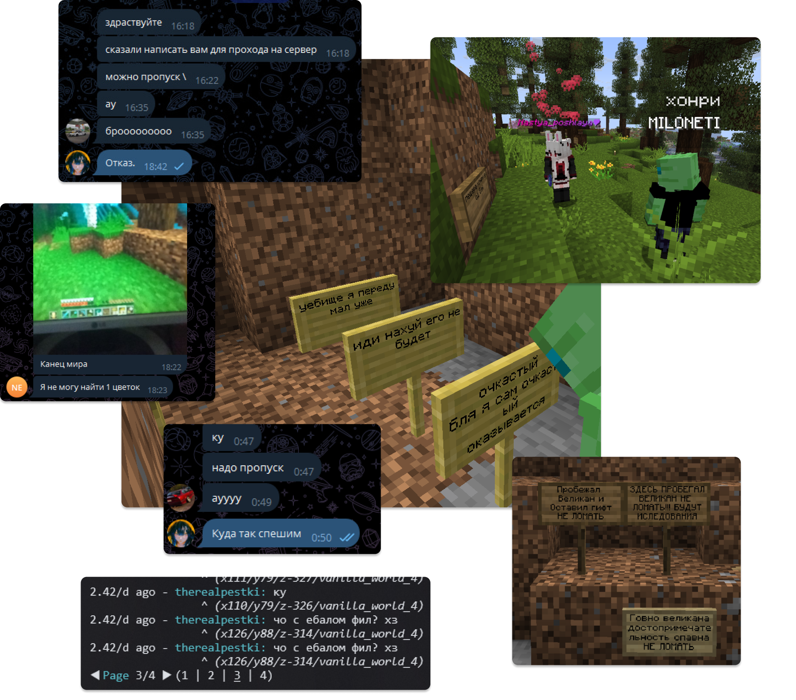

# Итоги за первые две недели 4-го сезона

Окей, я снова почувствовал тягу выкатить пост нытья... и немного мыслей и итогов по проекту.

Это идёт... всё так же тяжело.

### Бездна чебоксарства

Хотя на сервере сложилась некоторая группа постоянных игроков, этот сезон опять не задался. И чёрт возьми, я не понимаю, почему комьюнити Minecraft так деградировало... По результатам бесед с игроками, средний возраст приходящих с рекламы - 9-14 лет, и по ощущениям, процентов этак 70% из них оказываются воришками/гриферами или просто неадекватами.

На сервере снова царит абсолютное чебоксарство, и от былой атмосферы, как была в лучших сезонах, как первый и третий, не осталось ничего. Лишь постоянное воровство, ругань в чате в перемешку с неграмотно написанным попрошаничеством _дать ресов_, и спавн, сгорающий каждые несколько часов.

### Безысходность ваниллы+

Я каждый вечер задаюсь вопросом, зачем я вообще открыл 4-й сезон...

Если лучший из сезонов, 3.0, был открыт по активным просьбам большой (около 8 человек) группы старых друзей, которые ещё и вложились в открытие, то 4.0 был открыт потому что... "так надо"? Потому что... У меня нет другого занятия, кроме как делать сервер?

3-5 человек изредка выражали желание поиграть, и по итогу некоторые из них даже не пришли. Я же работал над открытием в ужаснейшем моральном состоянии, и до сих пор в нём остаюсь. После тех печальных событий со скандалом, утратой старой аудитории, и мёртвого сезона 3.3, я возненавидел основу (Vanilla+). Этот сервер теперь навевает крайне болезненные воспоминания об уходе друзей и крахе проекта, и заполнен малолетним гриферами, которым нет конца.

О донатах тоже вообще не идёт и речи. На хостинг и рекламу обоих серверов в сумме было потрачено 6700 руб, а заработано... 520. Такие большие затраты связаны с тем, что рекламы, было закуплено больше, чем когда-либо (плюс теперь есть ещё и расходы на Serenity). Однако приток с такого количества рекламы оказался крайне скромным, не говоря уже про качество аудитории...

То, что творится на основе, и отсутствие отдачи, вгоняет глубже в депрессию и полностью отбивает желание делать что-то для этих людей.

### Успех Serenity

Сервер по анкетам, Serenity, однако, оказался хорошей идеей. Я думал, что людям будет слишком лень писать заявки, но оказалось, что это не совсем так. Каждый день несколько человек пишут заявки. Да, это не 20+ новичков в день на обычном открытом сервере, но зато почти все эти люди оказываются адекватными и взрослыми, а небольшая беседа с ними позволяет отсеять потенциальных хулиганов.

Много дней на Serenity царила тишина, но с недавних пор там наконец собралось небольшое, но очень приятное комьюнити, и система по анкетам не даёт неадекватам попасть туда. 

Советем посмотреть в сторону этого сервера, всем, кто там ещё не был! Напомним, что заявку можно оставить в [#🪪get-pass](https://discord.com/channels/767405329549885440/1400744932456792125).

### Выводы

На основе всего отрефлексированного могу сделать следующие выводы:

1) В словах некоторых игроков, заходивших ранее и удивлявшихся нашей открытости, была доля истины. Бесплатный пропуск по анкетам работает лучше, чем мы думали, в плане количества желающих. Похоже, это становится необходимостью для любого сервера в этой новой реальности... Но так мы теряем элемент весёлого хаоса от залётных чебоксаров, что всегда было важным элементом культуры OUTBREAK...

2) Сезон 3.0 был показательным образцом того, как следует стартовать проект. Следующие сезоны надо открывать с предварительным "подогревом" желающих из старой аудитории, и сбором средств, так как донаты в современных реалиях могут больше не прокатить.

3) Сейчас нам нужно придумать, как воскрешать основу, так как она эффективно мертва. Мне видится хорошей идеей доделывание начатого плагина, который будет ограничивать новичков от подозрительных действий, как, например, использование зажигалки в первые же несколько минут игры, и автоматически наказывать за явные нарушения.

4. С таким новым поколением у человечества нет шансов.

### Нужна ваша помощь!

С такими дырами в бюджете и столь печальной ситуацией на основном сервере, нам как никогда нужна поддержка от комьюнити!

Вы можете бесплатно в пару кликов проголосовать за нас на мониторингах и помочь с продвижением или же поддержать нас финансово.

Обо всех способах поддержки можно подробно прочитать [здесь](/other/supporting).

**Благодарим, что вы с нами! 💖**