

### Истоки
Локес, также известный как LokesL, впервые появился на проекте в первом сезоне, в начале 2021 года. Он стал активным игроком и участником сообщества, и, так же как и Horny примерно в то же время, был приглашён в команду, став модератором.

За годы через команду OUTBREAK прошло много людей, однако почти все из них были мимолётны. Одни вскоре теряли интерес к игре или время на неё...  Другие покидали команду из-за разногласий... Третьи не обладали стремлением развиваться самим и вместе двигать проект вперёд... И только Хорни и Локес оказались исключением. С ними мы стали теми самыми лучшими друзьями, которые шли рука об руку год за годом. Локес и Хорни проводили на сервере каждый день по многу часов. Без них не проходило ни одного мероприятия; они помогли забанить тысячи гриферов; вместе с ними мы строили карты для мини-игр, которые так и не открылись; вместе настраивали плагины и тестировали их; вместе переживали долгие паузы в работе проекта, после чего вместе возвращались, чтобы отстроить всё заново с новым величием... Троица из меня, Локеса и Хорни была неизменной и непоколебимой основой команды OUTBREAK.

Совпало так, что оба этих человека были очень скрытными. Даже спустя долгое время совместной работы и постоянного общения, мы не знали друг о друге буквально ничего, даже настоящих имён. Я, впрочем, всегда уважал анонимность, и ничего не имел против дружбы в таком формате.

Однако, если Хорни, несмотря на свою скрытность, ощущался простым и добродушным человеком, то с Локесом всё было совсем не так просто... Хотя Локес всегда показывал лояльность, был большим добряком и вызывался помогать в любых начинаниях, его всегда окружала аура загадочности и недосказанности. Он имел глубокие познания в различных сферах, но был молчалив и никогда ничего о себе не рассказывал... Локес часто бывал очень серьёзным, а порой даже жестоким, когда дело касалось расправ над нарушителями. Мы с командой изначально чувствовали, что под этой маской добряка к своим, скрывается злой гений с хаотичным разумом. Это несколько напрягало меня в нём как в друге и сотруднике - неизвестно было, что он выкинет с его знаниями и возможностями. Но время шло, а Локес ничего не выкидывал, наоборот стабильно продолжая активнее всех участвовать в развитии проекта и даже поддерживать крупными донатами.

### Чудо третьего сезона

Сезоны 2.0 и 2.1 выдались для OUTBREAK провальными. Активности не хватало, реклама работала плохо и качество приходящей аудитории было ниже некуда. С финансами была беда, а в команде чувствовалось выгорание, особенно сильно затронувшее меня, в то время 24/7 занимавшегося разработкой кастомных плагинов. Было понятно, что продолжать работу в таком режиме невозможно, нет смысла, да и деньги совсем закончились. Наблюдалась усталость и утрата интереса как у всех нас, так и у сообщества игры в целом. Решено было вновь закрыться на неопределенный срок, ставший в итоге самой длинной паузой в истории проекта.

OUTBREAK свернулся до небольшого оффтоп-чата, где старожилы уютно беседовали о жизни и всём-всём-всём, а я занимался своими делами, развиваясь в других направлениях и практически не общаясь с основной командой и не думая про OUTBREAK... Но неожиданно, к концу 2024 года, игроки стали всё чаще вспоминать про Minecraft и высказывать желание вновь окунуться в игру на любимом сервере. Сам я всё ещё чувствовал апатию к игре, однако количество просьб открыть сервер в какой-то момент стало совсем уж неожиданным и воодушевляющим, и DARKXIUS, старый игрок и мой хороший друг, решительно скомандовал немедленно объявлять сбор средств на открытие и начинать подготовку, подкрепив слова крупным первым донатом.

Подготовка объединила много старых игроков, желающих вернуться, и нам удалось собрать средства на открытие и рекламу даже с запасом. 21 декабря 2024 долгожданный сезон 3.0 стартовал. Я бы сказал, что это был самый здоровый запуск, который у нас когда-либо был - много дружной соскучившейся аудитории и успешные сборы обеспечили высокий онлайн и стабильный хостинг, и дали нам много мотивации работать над проектом.

Третий сезон безусловно стал новым лучшим сезоном. Его даже сравнивали с легендарным первым сезоном, в повторение успеха которого никто уже не верил. Проект процветал - онлайн, вовлечённость игроков и донаты росли, однако вскоре этот резкий рост обнажил и старые проблемы и разногласия. Идиллия начала давать трещины, и то, что мы приняли за возрождение проекта, медленно начало оборачиваться началом самого тёмного периода в его истории...
### Явление FoxRin

Основные события этой истории завертелись после того, как вечером 27 января 2025 на сервер зашла **FoxRin** (**Рина**). 

С Риной всё с самого начала было крайне неординарно... Взять хотя бы тот факт, что она решила купить донат ещё перед тем, как зарегистрироваться на сервере...

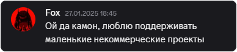

После покупки доната, FoxRin заинтересовалась ещё некоторыми вопросами, и в результате у нас завязалась долгая приятная беседа. Она оказалась близкой по духу и приятной собеседницей; поведала, что работает в интересной мне сфере кибербезопасности, а также пишет различные статьи. По её словам, она недавно начала играть в Minecraft, но пока что её опыт сводился к анархическим проектам с недружелюбной атмосферой, так что это её первый "добрый" сервер.

FoxRin понравилось наше комьюнити, и после экскурсии по серверу она решила написать на одном сайте про игры статью о своём опыте вхождения в Minecraft. Со статьёй, правда, дело не задалось, но зато FoxRin придумала основать наш собственный канал с новостями - 

С самого начала Рина проявляла активное в участие в жизни проекта - стала первым журналистом; много общалась с игроками лично, стараясь всё разузнать и со всеми подружиться; помогала следить за порядком, и вскоре была принята на роль модератора.

Однако странности, связанные с ней, никуда не делись, и их количество только росло. Одной из самых неожиданных вещей для меня было то, с какой теплотой и инициативой Рина тянулась ко мне в личном общении. Я не понимал, что её во мне так зацепило. Она подчёркивала мою доброту и вежливость, общие взгляды и увлечения... Я же поражался её всесторонней эрудированности и ловил себя на том, что мы мыслим удивительно схоже.

Мы всё больше общались день за днём. Рина была невероятно милой, но я всё время чувствовал что-то неладное... будто всё это является манипуляцией, о чём я даже прямо заявлял в начале. Её слова про «неделю в игре» не стыковались с тем, как хорошо она разбирается в игровых механиках... Её скрытный, мрачноватый характер и в то же время резкая открытость и тяга ко мне... Ещё и покупка доната до захода на сервер... Всё это было очень подозрительно. Но чёрт возьми, она была настолько... в доску своей. С ней, я чувствовал, будто мы выросли вместе. Её слова, мышление, вайб - всё ощущалось до боли родным... 

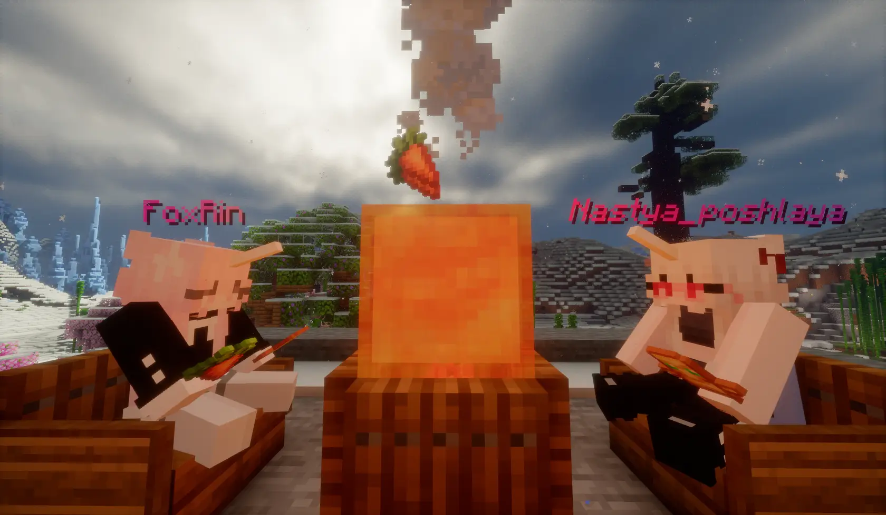

7 февраля мы с FoxRin, Horny и одним залётным игроком устроили невероятно вайбовые посиделки на крыше дома у спавна. Мы просидели всю ночь, до позднего утра, общаясь и смотря на пиксельный дым костра... И, кажется, именно на этом моменте финально закрепилось понимание: между нами завязывается нечто большее, чем дружба. Но вместе с этим росла и тревога. Это эскалировало неадекватно быстро. Ещё и все эти странные моментики... Я чувствовал, будто нахожусь в хрупком сюрреалистичном сне, где всё фальшиво; сне, который вот-вот должен обернуться кошмаром.
### Странные намёки
16 февраля на сервер пришёл игрок под ником **URAXARA** (он же **VENTOSS**). Хоть он и показался с самого начала немного токсичным, он был неплохим общительным и дружным человеком, и тут же влился в компанию.

Однако вечером того же дня начались странности. Рина написала мне, что её пробила на эмоции беседа с Урахарой, в которой он рассказал, что 5 лет назад дружил с девочкой по имени Рина, подозрительно похожей на неё. И FoxRin намекнула, что видит себя в его рассказе.

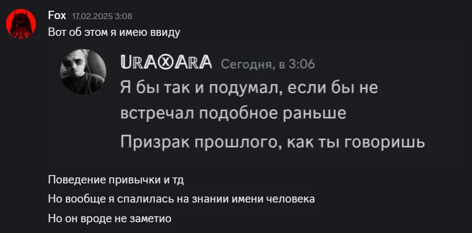
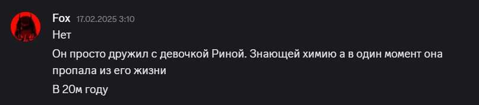

Всё это было очень подозрительно... К тому же, Рина упомянула, что расстались они как раз примерно в то время, когда в её жизни произошёл один переломный момент... Я попытался аккуратно, расспросить, был ли это в самом деле Урахара, но она ушла от ответа. В последствие они ещё не раз упоминали этот странный инцидент, но так и не признавали свою связь, которая, тем не менее, была очевидна, учитывая улики, на которые мы натыкались позже.

### Сарайские раздоры

#### Инцидент первый
Начало февраля 2025. **FoxRin**, едва начавшая оправляться от своей депрессии благодаря тому, что нашла уютный сервер и много хороших друзей, решила позвать в нашу компанию старого друга - **Еврея** (да, это именно то, как его и зовут), также известного под ником **Nemesida**. Но приглашение пошло не по плану...

Еврею "повезло" зайти прямо в момент, когда игрок **Syaran** (он же **Сарай**) устроил скандал с **GRXDRXS** из-за того, что тот построил свою башню слишком близко к его городу, Сарайску.

Вместо обещанного уюта, Еврей увидел в чате матерящихся школьников, и сразу же вышел, закрепив негативное впечатление о проекте. FoxRin была вне себя от обиды и злости на то, как Сарай опозорил сервер перед её другом. Планы привести остальную компашку рухнули, а вместе с ними - и около 8 потенциальных донатов, которые Рина планировала закупить для всех своих друзей.
#### Инцидент второй
Чуть позже, Syaran написал в чат `#🌌pics` шутку, которая задела Урахару. Тот вспылил и между ними вспыхнул длиннющий скандал, состоящий из сплошных оскорблений. Им намекали прекратить ругань, напоминали, что в `#🌌pics` вообще нельзя разговаривать, но вместо прекращения, они продолжили свою грызню ещё и в `#💭offtop`. 

По итогу оба токсика получили от меня таймауты в Discord на неделю (которые, кстати, были сняты раньше срока по просьбам окружающих)

Сарай отнёсся к этому снисходительно, а вот Урахара страшно взбесился и с тех пор начал считать меня врагом. И так как он "успел" стать другом Рины, она встала на его сторону и тоже в штыки восприняла наказание, игнорируя то, что Урахара объективно нарушил правила, устроив гигантский срач в двух чатах сразу. Да, Сарай спровоцировал первый, но ничто, не мешало им просто послать друг друга в самом начале, и не продолжать этот цирк и позор на глазах у всех.

#### Инцидент третий
15 февраля Syaran проводил на сервере ивент, где игроки выступали как стэндаперы. Ивент, однако, оказался скучным, и начавшие развлекать себя как могли игроки в результате сорвали его. Это обидело Сарая, и у них опять произошла перепалка с Риной.

::: details длинный исторический документ
[Скриншот переписки](pics/smexbreakscandal.jpg)
:::

#### Инцидент четвёртый
6 марта Syaran и FoxRin снова не поладили. Это были времена, когда фишка с изменением роста (`/resize`) ещё только-только появилась на сервере. Тогда Сарай возмутился, почему подруга Рины Чифа ходит очень маленькой.

::: details исторические документы
[Скриншот 1](pics/syaranchifa1.png)
[Скриншот 2](pics/syaranchifa2.png)
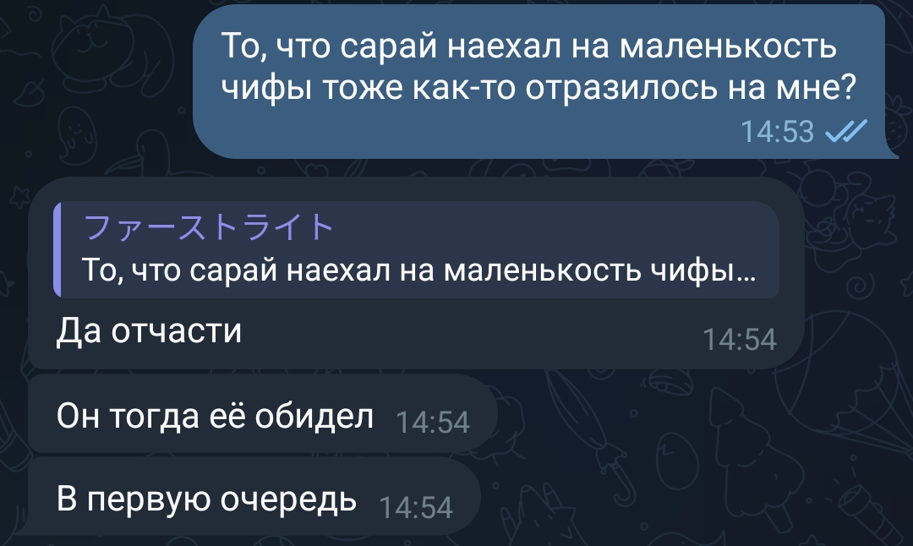
:::

Поскольку Рина очень дорожит Чифой, данная предъява была воспринята ею как личное оскорбление, и её снова обидело то, что Syaran ничего не получил за эти слова.

#### Итоги инцидентов
Итогом четырёх инцидентов стал тяжкий ущерб в дружбе между всеми нами и оставление массы негативных эмоций:
- Рина, подвергшись оскорблениям от Сарая, обиделась на меня за то, что я был слишком мягок к нему как админ и не защитил её от негатива как друг или парень (хотя Сарай каждый раз получал от меня муты и варны).
- Еврей сложил о проекте паршивое печатление и передумал здесь играть и приводить друзей, что также очень огорчило Рину и отменило финансовую поддержку проекта.
- Урахара затаил на меня величайшую злобу за тот мут и при каждом удобном случае токсично припоминал мне это. Рина тоже была недовольна.

Мы всё ещё много играли и общались с Риной, однако где-то к концу февраля я начал замечать, что её характер меняется. Её активность на проекте, общительность и то самое внимание ко мне угасали. Она стала молчаливой, холодной ко всем и нервной... Человека словно подменили. От той разговорчивой, инициативной и интересующейся всем и всеми Рины не осталось и следа...

В наших отношениях повисло напряжение. Вместо узнавания друг друга получше и становления более близкими, вещи только усложнялись; всё становилось страннее, запутаннее и мрачнее...

### DDoS атаки в начале марта
Во время подготовки весеннего обновления, сервер OUTBREAK внезапно подвергся DDoS-атакам мощностью до 18.5 Гбит/с. Ничего подобного не было за все годы существования проекта. Для сравнения, владельцы других серверов говорили об атаках максимум в 4 гигабита.

Разбирающиеся в кибербезопасности Рина и Еврей вызвались помочь настроить фильтры. Несколько дней мы отбивались, экспериментируя с настройками. Ещё несколько дней воевали с недовольным хостингом, который начал отключать нам интернет за перегрузки... В итоге переговоры с поддержкой ни к чему не привели, и пришлось покупать их платную защиту. Ситуация была вымотана до предела, но мы справились.

Прохождение этих приключений стало важной отправной точкой. С одной стороны, мы (как, по крайней мере, казалось) стали сплочённее и получили ценный опыт защиты, а также реформировали нашу команду, утвердив роль куратора. Теперь, помимо меня, Хорни и Локеса, в ядре команды числились FoxRin с Nemesida. С другой же стороны, теперь эти люди, с которыми было связано столько странностей, имели полный доступ к машине...

Таинственных вопросов, связанных с проектом, стало ещё больше... DDoS мощностью под 20 гигабит - это сложно и дорого. Кому понадобилось тратить такие ресурсы на маленький некоммерческий проект с 25 онлайна? Рина выдвинула версию, что это мог сделать один человек, с которым они недавно поссорились в чате. Но с чего она взяла, что какой-то случайный игрок из-за спора в интернете вложит огромные деньги в атаку на сервер, где она играет? Версия казалась мне очень слабой и странной, но других вариантов у нас в любом случае не было.

Помимо всего прочего, где-то в это же время, что-то подозрительное начало происходить с Локесом. Его активность резко снизилась, а примерно к 10-м числам марта он и вовсе исчез отовсюду... Впрочем, Локес часто упоминал, что у него много работы, так что на это сначала вообще не обратили внимания.
### Развитие R3 и моё отчуждение
Тем временем на сервере кипела жизнь. Рина и её друзья основали подземный город, именуемый R3, в который позвали всех самых социально активных игроков.

Одним из главных символов города стала Чифа - подруга Рины и Урахары, которую они привели с другого сервера. Сама по себе она почти ничего не делала, но была милой и забавной, из-за чего вокруг неё начал собираться некий мемный культ. Также она запустила локальный мем про картошку, строя огромные поля, а дополнительной мемности и милоты Чифе добавляло то, что она ходила уменьшенной при помощи админских команд.

Чифа завоевала большую любовь со стороны Рины. Она дорожила ею, словно дочерью. Если Чифе нужна была какая-нибудь помощь - Рина бросала всё. Если кто-нибудь говорил о Чифе что-нибудь неуважительное - свирепо бросалась в перепалку. 

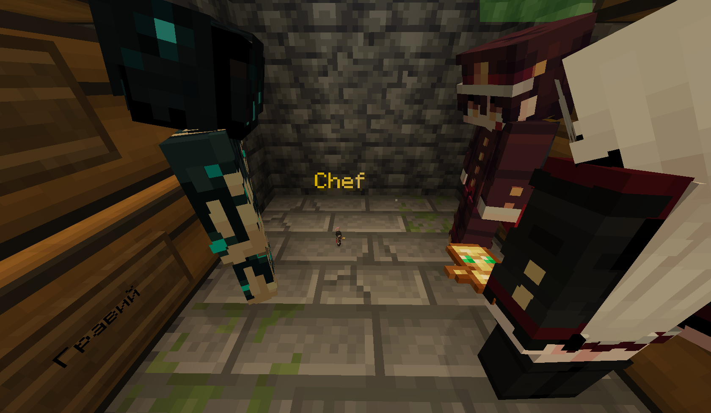
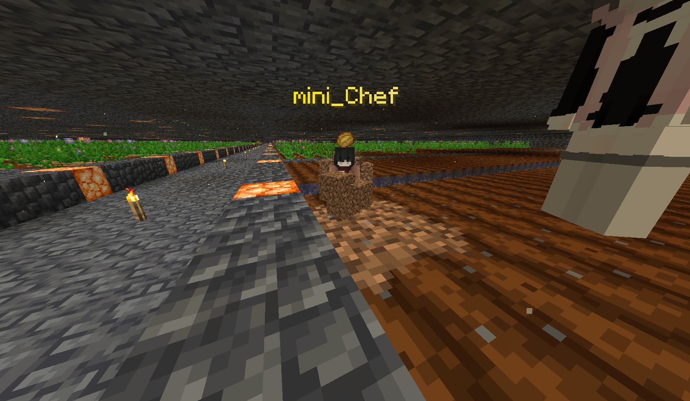

В какой-то момент я поймал себя на том, что Чифа меня серьёзно раздражает. Мне было омерзительно смотреть, на тот неадекватный уровень подлизывания к ней со стороны Рининой компании. Чифа не делала ничего выдающегося - почти не писала в чат; не строила грандиозных построек; не устраивала ивентов; не рассказывала интересных историй... Она просто... была. И за это ей доставалось всё внимание.

Я уже знал, как работает Ринина предвзятость и слепая защита _своих_. И знал: случись что-то со мной - никто из них не окажется рядом так же быстро. 

Вообще-то, я уже давно, где-то со времён выходок Сарая, смотрел на всё это и чувствовал, как между мной и этим кругом вырастает стена. Мы всё ещё общались с Риной и играли вместе, но что-то неуловимо сломалось. Раньше я чувствовал себя частью её мира, её компании. Теперь же они все затаили неприязнь ко мне, раздутую из сотен мелочей, и их круг был для меня полностью закрыт. Они собирались в R3, шутили о чём-то своём, обожали Чифу, а я... я просто был рядом, пытаясь хоть как-то поддерживать общение. Неприязни к Чифе я тоже никак не показывал, продолжая подыгрывать их мемам ради налаживания дружбы.
### Эскалация конфликта с Nemesida и URAXARA

Nemesida (Еврей), вышедший из тени и начавший больше общаться с нами во времена помощи с защитой, имел вспыльчивый и склонный к токсичности характер. В первый же день общения впечатление у меня о нём сложилось скверное - из-за какой-то глупости он весьма нешуточно накричал на FoxRin. Я возмутился, но Рина отмахнулась, назвав это их привычным дружеским стилем общения, хотя со стороны выглядело это не по-доброму и контрастировало с тем, что на крики какого-то школьника в интернете Рина обижалась, а на это - нет.

Что-то ненормальное начало происходить примерно 16 марта. Еврей (Nemesida) и Урахара, оба известные своей токсичностью, внезапно начали целенаправленно травить меня, практически на ровном месте, будучи негативно настроенными ко мне из-за различных конфликтных событий, описанных выше. Их «шуточки» со временем переросли в откровенную клевету и оскорбительные обзывательства. Дошло даже до того, что в это вмешалась FoxRin, являющаяся своего рода авторитетом в их компашке, и попросила их прекратить. Но они не остановились, а лишь придумали другие обзывательства.

Атмосфера в войсе становилась ужаснее с каждым днём. Я старался игнорировать провокации, спокойно опровергая клевету и напоминая о неадекватности их поведения. Да, ситуация требовала действий, но опыт прошлых блокировок показывал: если раздать баны сразу - это вызовет волну недовольств среди их друзей, и особенно у FoxRin, отношения с которой я всеми силами пытался спасти и починить. Поэтому я терпел и ждал, пока неадекватность и абсурдность происходящего станет максимально очевидной для всех, сидящих рядом - тогда то и можно будет спокойно избавиться от нарушителей и выйти благородным победителем.

📍 Всё прошло по плану. К вечеру третьего дня, 18 марта, чат превратился в безумный цирк, переходящий все границы. В этот момент я забанил Урахару как главного зачинщика. 

Хотя мне очень хотелось забанить сразу и Еврея, я не стал этого делать - всё-таки он оставался слишком полезен для проекта (в основном засчёт того, что был лоялен лояльной Рине и помогал с тем, что она попросит для нас), плюс это наверняка вызывало бы тотальный срыв у Рины, которая и без того держит на меня прошлые обиды. А поскольку происходящего здесь Рина практически не слышала, доказать ей его неадекватность будет просто нереально.

После бана в чате воцарилась тишина.

### Неадекватный звонок и начало странностей

Где-то через полчаса после того, как это закончилось, мне поступает звонок из приватной беседы. Как только я нажал на зелёную кнопку, в мои уши обрушился оглушительный хохот и крики с оскорблениями голосом Урахары. Я отключился от голосового канала. После всего пережитого я уже ничуть не удивляюсь услышанному. Как вдруг, в списке участников я заметил **Sipulechka**.

**Sipulechka** была нашим давним активным игроком, она была доброй и милой, и встретить её в группе, где сидят такие злые неадекваты, было крайне неожиданно.

> _Ну и ну, кого-кого, а Сипулечку я здесь встретить не ожидал_

— написал я в чат.

Реакции не последовало, а через пару минут меня выгнали из беседы, и я вернулся в войс OUTBREAK, где сидели другие наши игроки....

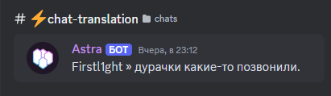

📍 Через полчаса к нам в войс OUTBREAK снова заходит Еврей и внезапно уличает меня в том, что я якобы наехал на Сипулечку, чему я опять же очень удивляюсь и пытаюсь выяснить, в чём же был "наезд"? Он не ответил прямо; наоборот, судя по всему, где-то в этот момент ему пришла идея извратить мой вопрос, что она там делает, преподав его всем как упрёк.

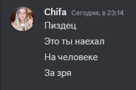

Не обращайте внимание на ник Chifa. Это было локальным мемом, и в тот день такой ник поставили многие из нас.
В это время Рина увидела, что в чате опять происходит какой-то негатив и лично забанила Еврея в Discord OUTBREAK, сославшись позже на свои же недавние слова про то, что провокаторов нужно убирать сразу.

Тем временем разозлённый Еврей в игре принялся угрожать мне и всем нашим, что откроет свой сервер "ЕврейКрафт" и уведёт туда всех жителей R3, забрав почти всё основное комьюнити OUTBREAK. До этого они с друзьями уже вскользь упоминали, что у Еврея есть какие-то заготовки для создания сервера и опыт в этом.
### Преддверие катастрофы

Подведём итоги странностей и тревожных моментов, накопившихся на момент вечера 18 марта.

Отношения с Риной, и, особенно, с её друзьями, сильно пошатнулись ссорами в комьюнити. Некоторые из старых активных игроков и персонала были уволены или вовсе забанены, что подогревало недовольства.

Накопились загадочные инциденты, в которых от нас явно пытались что-то скрыть с неведомыми целями.

На этот момент точно понятно, что Урахара - не случайный игрок. Из общения Еврея и Рины точно понятно, что он является их старым другом. Зачем было скрывать это?

Уже никто не верит во вброс о том, что у FoxRin нет опыта в Minecraft. Она вдоль и поперёк знает механики игры и даже работала с кодом.

Кто и зачем устроил DDoS атаки, которые Рина с Евреем с таким подозрительным энтузиазмом вызвались отражать?

📍 **Но самое главное:** из разговоров всплыла информация о каких-то связях Рины с Локесом, нашим давним куратором. А значит, что и сама Рина вовсе не _"нашла OUTBREAK на мониторинге и выбрала нас потому что понравилось оформление и сайт"_, как сама рассказывала.
**Сомнений нет - это Локес позвал её сюда, и они оба зачем-то скрывали это, прибегая к откровенной лжи.**

А теперь ещё и Еврей, угрожающий увести множество игроков... С Чифой, Урахарой и, возможно, даже Риной, всё ясно. Но угроза увести других, давно лояльных нам людей, выглядела скорее как блеф... Или же они уже завербовали в свою компашку и их?

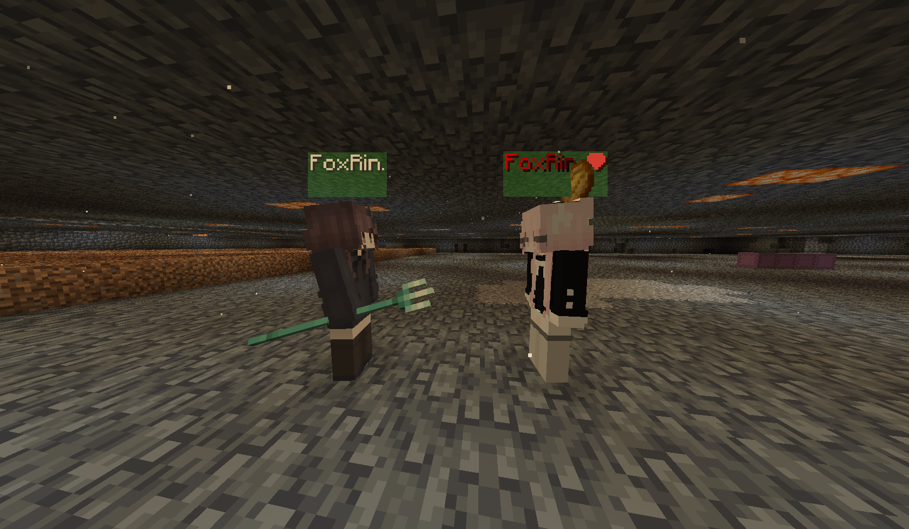
Это был последний скриншот, сделанный в сезоне...
### 📍 Первый удар
18 марта 2025, 23:46. Меня вызывают по причине того, что с сервером что-то случилось - вышедшие игроки не могут зайти обратно.

Проблема выглядела как то, что происходило с постоянной периодичностью, и я подумал, что это в очередной раз завис хаб. Я не глядя вписал команду перезагрузки хаба в уже открытую консоль и отошёл дальше заниматься своими делами.

Однако вернувшись минут через 15, я увидел, что проблема не решилась, и всё стало только хуже. Я попытался рестартнуть основной сервер, но и это не помогло. Я хотел прописать `sudo reboot`, но сервер отверг мой пароль (сама сессия ssh висела открытой ещё заранее)... Дела совсем странные - подумал я, и зашёл в панель хостинга, чтобы перезагрузить машину оттуда.

Машина включилась. Но сервер не поднялся. В консоли до этого я краем глаза заметил спам ошибками подключения к базе данных, так что решил посмотреть, что за хост указан в конфиге - вдруг кто-то из кураторов что-то обновлял в плагинах, или же Рина с Евреем сломали что-то при настройке защиты...

📍 Зайдя на сервер, я обнаружил, что все папки (сами игровые сервера, база данных и прочие) пусты. Кто-то взломал сервер, и удалил с него все данные. Причём точечно, оставив систему и пустые папки.

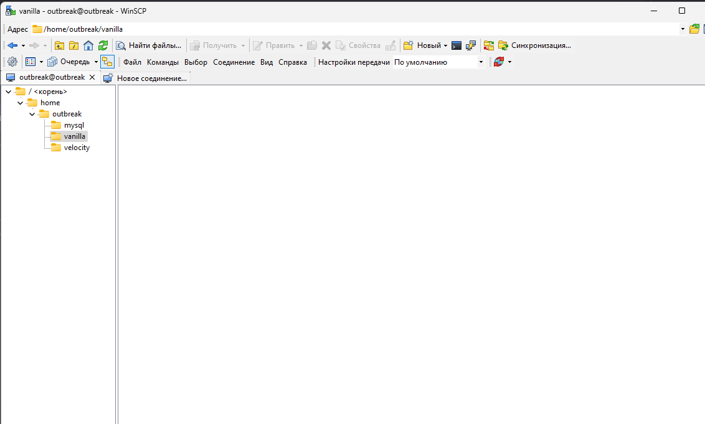

Удалены были также история команд и RSA-ключи (`.ssh/authorized_keys`). 

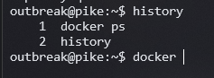

Мы собрались в беседе стаффа и начали обсуждать всевозможные улики и раздумывать, как это произошло, и что делать. Весьма очевидно прослеживалась цепочка событий:

::: info 

У Еврея был доступ к серверу.  
@  
У Еврея был наш VPN, ip которого засветился в `last`.  
@  
У Еврея глубокие познания в сфере кибербезопасности, чтобы гладко всё провернуть.  
@  
Еврей показал себя как невполне стабильный, токсичный человек.  
@  
За некоторое время перед взломом Еврей угрожал мне, что уведёт своих друзей (Чифу, Рину, Сипулечку, Крю) на некий свой сервер.  
@  
Вскоре после нашей перепалки, Еврей агрессивно уличает меня в выдуманном "наезде" на Сипулечку, что после всего этого выглядит как спланированная операция против меня.  
@  
У нас с Евреем был диалог про то, что я имею привычку почти не делать бэкапы (скриншот ниже), что добавляет событию вида злой шутки.  
@  
После ссоры с Евреем у меня удаляется сервер, а в почему-то не удалённых логах входов (`last`) светится вход через IP нашего VPN (и сам я никогда не использую его для входов на сервер, у меня на постоянной основе была настроена раздельная маршрутизация трафика).  
@  
Сам Nemesida заходил на сервер с этим IP буквально в эти же часы - это записалось в трансляции консоли в Discord.

:::

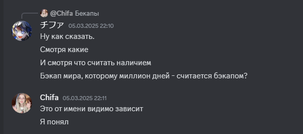

::: details Также была составлена предположительная хронология по входам на сервер, которые злоумышленник не удалил:

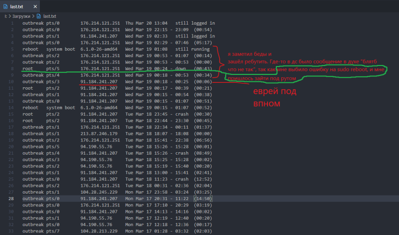

:::

Другие кураторы, такие как Локес и Horny, по началу особо не рассматривались, так как на протяжении всего многолетнего знакомства вели себя максимально добродушно и лояльно, и с ними никогда не было никаких конфликтов и разногласий.

Разве что Локес вызвал подозрения тем, что куда-то исчез в дни конфликтов, и у него также был и доступ к серверу, и наш VPN, с ip которого совершён взлом... Никаких мотивов вредить нам, впрочем, мы у него не наблюдали...

Рина конечно же сразу жёстко встала на сторону защиты Еврея...

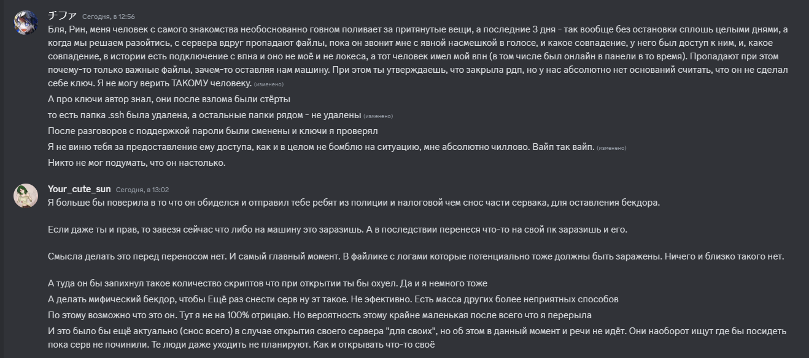

### Планы на сервер
Ночью с 18 на 19 марта мы с командой проводили обсуждение того, что теперь делать с сервером. Также на связь вышел Локес, почти не появлявшийся в последнее время.

Бэкапов адекватной свежести не сохранилось, однако нам удалось вытащить из кэша `.bobby` на клиентах практически все чанки мира. Была лишь одна проблема... К кэш не записывались инвентари и сундуки, так что все сундуки в востановленном мире были бы пустыми, как и инвентари игроков. Мир существовал несколько месяцев, и игроки добыли огромное количество ресурсов. Их потеря означала бы практическую потерю смысла игры.

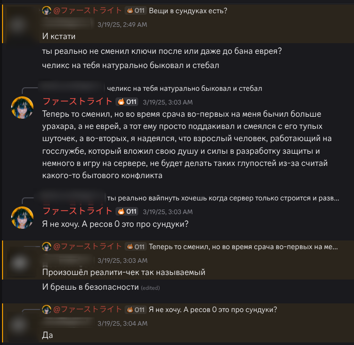
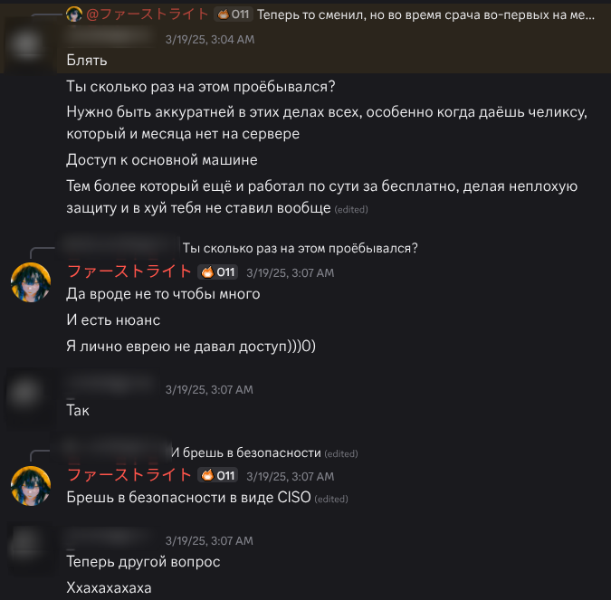
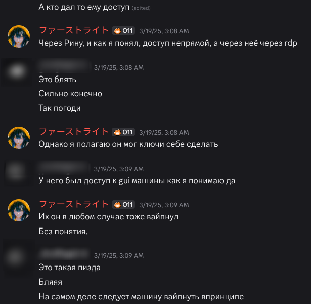

На удивление Локес всё ещё общался по-доброму на этом этапе, выражал озабоченность ситуацией и не походил на злодея.

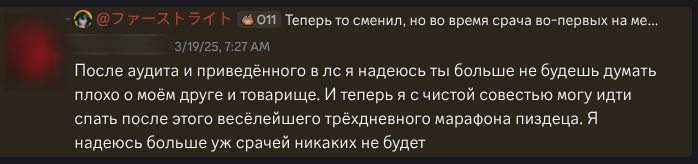
Увы, надежды Рины не оправдались...
### 📍 Внезапное развитие псиопа
В час ночи с 19 на 20 марта мне написал наш модератор GRXDRXS с внезапной для меня вестью о том, что Sipulechka и ещё несколько человек были забанены, и якобы мной (бан был выдан "анонимно", от лица консоли).

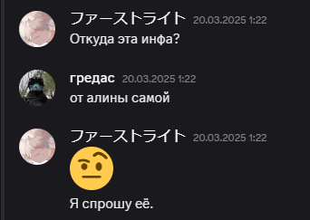

И, как выяснилось, забанена была не только Сипулечка.

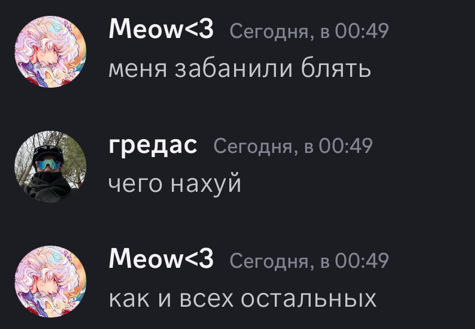

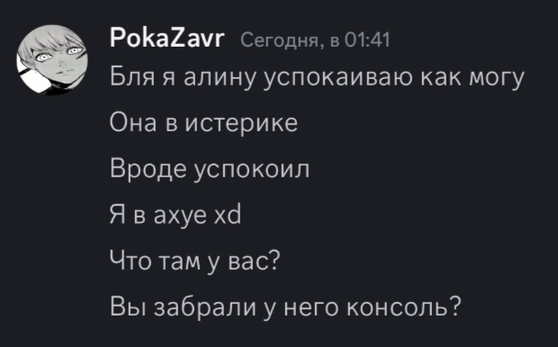

Вместе с ней забанены были и Чифа, и, предположительно, Аракул и Крю, а также, как (по моей невнимательности, сильно позже, чем хотелось бы) выяснилось, даже сама FoxRin...

Когда снесли файлы сервера, я отнёсся к этому очень хладнокровно. После всех тех странностей и переживаний, через которые мне довелось пройти за последние пару месяцев, такое уже не могло ни удивить, ни вывести меня из себя. Ещё после тех атак я думал о вероятности чего-то подобного... Я лишь спокойно посмотрел на пустые папки и подумал <i>"Что-ж, очередное приключение... Ну, погнали разбираться..."</i>. Однако, когда злоумышленник влез в мою личную жизнь и тронул моих друзей, я уже был шокирован по-настоящему.
### Разочарование в Чифе и Сипе

Узнав про баны, я поспешил написать Чифе и Сипе, чтобы успокоить их и по возможности донести то, что это было всего лишь ошибкой, но они обе встретили меня совсем не так, как я ожидал...

Сипа истерила и ничего не слушала. Успокоить её не получилось. Что-либо узнать - тоже. Она была абсолютно не готова разговаривать.

Я, конечно, понимаю: внезапный бан на любимом сервере вместе с друзьями, начало каких-то жутких разборок - это шок. Но когда тебе пытаются помочь, объяснить, что произошла ошибка - зачем истерить? Зачем так резко срываться с диалога?

Чифа разочаровала меня ещё сильнее, хотя на что я надеялся... Как позже выяснилось, Рина прямо приказала ей игнорить меня, чему она покорно подчинилась без вопросов и попыток разобраться. Просто перестала существовать для того, кто считанные дни назад был её хорошим другом, и о ком она сама мило отзывалась.

Нет сомнений - это в сообществе друзей Рины, так называемой «Переговорной», начавшей зарождение где-то на этапе того неадекватного звонка, Чифу, Сипу и других, убедили, что это я предатель и главный злодей, подстроивший всё. И они поверили.

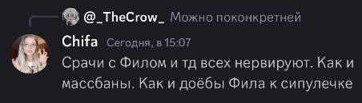
На скриншоте - сообщение Еврея (с изменённым во время мемного форса ником) в ответ Крю, который также покинул нас, будучи промытым их пропагандой

### Создание «Переговорной»
Где-то во время начала конфликта был создан Discord-сервер "Переговорная", на котором Рина и Еврей собрали всех как-либо связанных с конфликтом людей и просто своих друзей для помощи в расследовании. Изначально предполагалось, что сервер должен стать "нейтральной зоной" для переговоров.

Однако понятие «нейтральная зона» почти сразу стало лишь смешным мемом. «Переговорная» превратилась в рассадник токсичности, которую туда привнесли Еврей с Урахарой. Да и сама Рина, со своим скрытным и обидчивым характером, не стремилась к объективности...

В итоге в первые дни существования Переговорной, там вообще не происходило реальных переговоров; лишь вербовка на свою сторону и пропаганда против меня и нашей команды...
### 📍 Главный инцидент
Атаки, конфликты, взлом сервера и удаление всех файлов, включая утрату мира... Ссора с множеством друзей из-за чьей-то масштабной диверсии... Казалось бы, что может быть хуже?

Тем не менее это всё показалось цветочками на вершине айсберга после того, что всплыло вечером 20-го марта...

Я хотел было обсудить с FoxRin ход расследования, но, написав ей, вдруг получил настораживающий ответ:
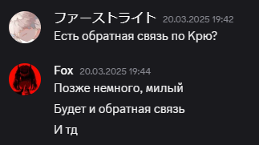

Что-то неладное явно прослеживалось в этих словах...

Через 20 минут Рина вернулась со скриншотами, которые повергли в шок всех, кто их увидел, а особенно меня.

На скриншотах была переписка, где некто с именем и аватаркой как у меня, обсуждал с кем-то, чьё имя и ава были замазаны, недавние события на проекте, очень грубо отзываясь о многих моих друзьях и опускаясь до открытых оскорблений. И это имело бы мало смысла, если бы не конец... В конце некто с моим ником начал пересылать из нашей переписки с Риной сообщения, содержащие очень личную информацию и фотографии. Приложу сюда первый из трёх скриншот этих фейковых переписок, как содержащий наименьшее количество конфиденциальной информации:
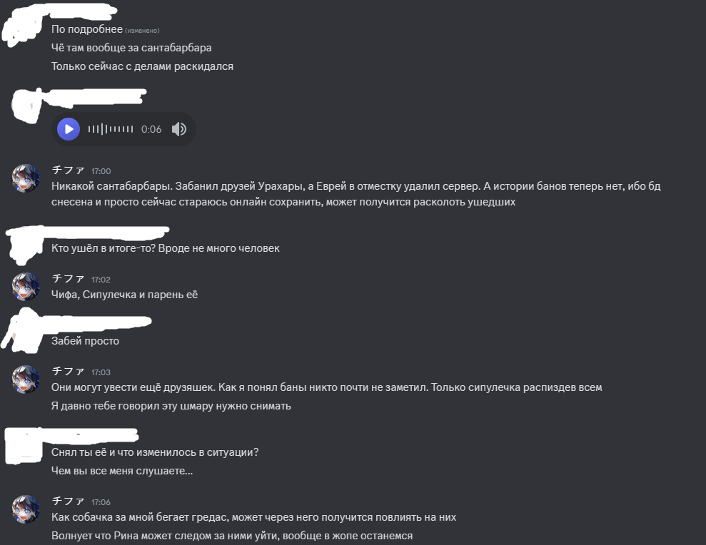

В чатах пошла новая волна разбирательств и домыслов... Я прокручивал в голове все возможные пути того, как кто-либо мог получить доступ к нашей переписке, но ничего не выглядело правдоподобно.

У нас обоих использвовались сложные пароли и двухфакторная аутентификация. Кроме того, мы оба заходили в Discord только через личный зашифрованный VPN, что делало невозможным перехват каких-либо данных. Никаких признаков взлома на моём аккаунте или устройствах также не прослеживалось.
### Процесс разбирательств и Переговорная

Следующие много дней шли напряжённые разбирательства - расспросы всех, кто хоть как-то мог быть к этому причастен и глубинные исследования всех оставшихся улик - скриншоты, логи, всё, что могло навести хоть на какие-то мысли.

Стресса в ситуацию добавляли действия Переговорной. Вместо того, чтобы помогать в расследовании, это сообщество стало ничем иным, как фан-клубом моих хейтеров.

Находящийся там Еврей был в бешенстве от того, как много улик указывало на него. Он всё отрицал и агрессивно продвигал версию, что сервер удалил я сам.

Урахара - просто орал и без попыток разобраться, лил поток вбросов и оскорблений в мою сторону.

Вдвоём они вдалбливали всем вокруг идею, что якобы я сам уничтожил свой проект, чтобы ради повышения активности устроить вайп, но не хотел признаваться игрокам. Никаких весомых обоснований в поддержку этого они не выдвигали. А то, зачем мне для этого понадобилось банить друзей и даже девушку, к которой я проявлял симпатию, вообще не объясняли. Единственным их аргументом было то, что мой IP находился в сети во время взлома. Факт того, что тогда же в сети был и IP VPN, используемого Евреем, Риной и Локесом, они игнорировали.

Несмотря на этот абсурд, Чифа, Сипулечка и некоторые другие игроки, попали под их влияние и почему-то поверили в эти вбросы.

Но главное, что делало всю эту историю по-настоящему невыносимой - полное отсутствие диалога, всеобщая скрытность и выгораживание "своих". Все люди, замешанные в конфликте, начали вести себя крайне скрытно и подозрительно. Все изолировались и молчали обо всём, что могло бы помочь расследованию, в том числе непосредственные пострадавшие:
- Сипа истерила и как специально не сообщала никакой информации;
- Чифа следовала приказу, кинув меня в игнор;
- Рина постоянно съезжала с тем и бездоказательно, игнорируя все наши доводы, говорила вещи вроде "нет, это не Еврей потому что он мой друг";
- Локес, который всегда был рядом, - просто исчез в самый трудный момент; 
- Урахара - как сумасшедший вопил оскорбления в мою сторону и вбрасывал различные выдуманные факты.

Настоящая холодная война. Хаос и паранойя, и никаких контактов, только разведка. Всё это приводило расследование в тупик. А кроме того, в Переговорную зачем-то добавили не связанных с конфликтом игроков, которые начали устраивать хаос, панику, вбросы и фоновый шум.

Любые попытки обвинить в этом их сторону встречали отвержение от самой Рины как пострадавшей стороны. _"я не верю, что мои друзья это сделали"_ - говорила она, игнорируя любые аргументы.

### Переговоры с Локесом

Рина в стрессе ночами перечитывала логи аудита, в которых, по её словам, не находилось никаких улик, и металась то на сторону обвиняющей меня Переговорной, то на мою.

Где-то между 20 и 21 марта, Рина, по всей видимости, подключила к разборкам Локеса, только вернувшегося после исчезновения, и у нас состоялся не очень-то приятный диалог, ощущавшийся как допрос меня.

В конце диалога Локес сказал, что в принципе понимает ситуацию, и _"как мог выгораживал"_ меня, беседуя с Риной до этого.

Вот только после этой беседы с "выгораживанием" Рина почему-то только сильнее стала уверена в моей виновности, а также в её словах, и словах её друзей, проскальзывали упоминания того, что Локес в действительности стоял скорее на стороне Переговорной и топил против меня.

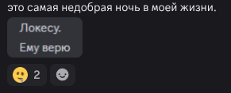

Уже к вечеру 21 марта Локес явно разуверился в своём выгораживании.
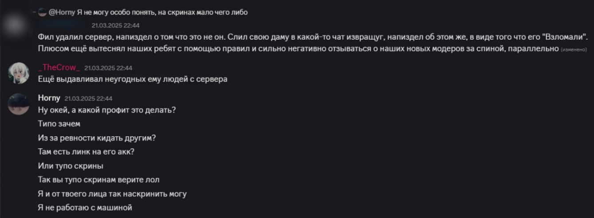

### Контрразведка
26 марта одному из наших агентов удалось провернуть поистине невероятную диверсию. Разведчик выдал себя за одного из старых друзей из Рининой компании, которых она собирала в Переговорной, и в ходе диалога с одной из участниц была получена шокирующая информация, меняющая всё.

(для соблюдения конфиденциальности, на скриншоте замазано множество имён людей, не связанных с этой историей, и другая личной информации, связанная с ними)
![[nastya-2025-03-27.webp]]

"Мелкий" в данном контексте - это Локес, а "Лисичка" - FoxRin. Здесь не только подтверждается их давняя связь, но и прямо говорится о том, что когда-то давно они уже делали что-то, напоминающее то, что происходит сейчас с нами. _"по фану"_,  _"когда им надоело"_. В сообщениях также упоминаются ссоры всех и даже взлом через подкидывание взломанных плагинов.

В конце собеседник упоминает, что слышал некий разговор, в котором кто-то из их друзей спрашивал Локеса про то, зачем тот уничтожил _какой-то_ сервер. 

Последнее, конечно, нельзя считать доказательством, т.к. это могло быть лишь чьим-то предположением, но предыдущие факты игнорирвать нельзя. Локес уже делал что-то подобное ранее.
### Файлы Локеса

Отдельно стоит отметить странность, очень подходящую под описанное выше, которую я заметил ещё давно.

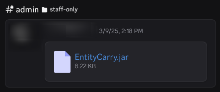

Когда мы обсуждали сборку сервера, Локес иногда кидал мне плагины сразу в виде jar-файлов, а не в виде ссылок. Для меня, как человека, имеющего представления о безопасности и о том, что можно в них зашить, это выглядело очень и очень подозрительно. Я предпочитал набирать в поиске название скинутого плагина и скачивал его из официального источника самостоятельно.

Однако были и моменты, где я точно запускал файлы от Локеса у себя. Так, например, незадолго до всего этого, 24 февраля, Локес вдруг попросил меня, чтобы я захостил ему сборку модов, на которой они хотели поиграть с друзьями.
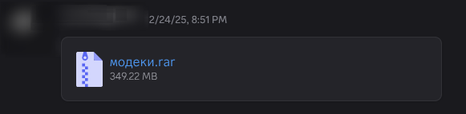
И я согласился помочь ему...
### Лживый триумф
Время шло, все были в стрессе, а конца конфликта не было видно на горизонте. Вообще-то, никто уже особо и не верил в виновность кого-либо из нас или из Переговорной из-за отсутствия нормальных доказательств и мотивов... Разве что Урахара как сумасшедший продолжал выкрикивать одно и то же... Но до него, не было дела ни обвиняющим, ни обвиняемым, ни пострадавшим...

По случаю тупика в расследовании, ночью с 28 на 29 марта было созвано совещание из меня, Еврея и Рины, на котором было принято следующее соглашение:
- Все участники конфликта признаются невиновными, так как весомых доказательств и мотивов ни у кого нет.
- Прекращаются споры и гонения, мы миримся и извиняемся друг перед другом за негатив.
- Забаненые Урахара, Еврей, Сарай и другие, получают разбан и живут дружно.

Однако эту историю видело уже очень много людей, так что было желательно ещё и как-то обосновать в новостях внезапное прекращение войны, так что мы решили выдвинуть выдуманного виновника, которого никто из наших всё равно не знает.

Этим виновником стала Кристал - одна из подруг Рины.

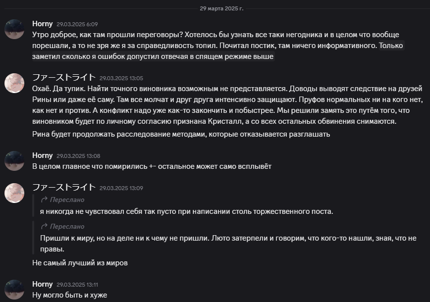

### Взрыв и затишье

Мы опубликовали новость и стали пытаться восстанавливать проект и наши отношения. Но дела не шли... Все осознавали, что хоть мы и прекратили активные боевые действия, дело не было завершено. Негодяй, разрушивший проект и рассоривший всех нас, не найден, и, вероятно даже, находится где-то среди нас.

Кроме того, на следующий же день после соглашения о невиновности, Урахара снова начал поливать меня оскорблениями. Между нами снова начали разгораться скандалы из-за личной неприязни и незаконченности дела. Урахара и Еврей вновь были забанены

Переговорная снова активировалась и начала генерировать пропаганду ненависти против OUTBREAK и меня лично.

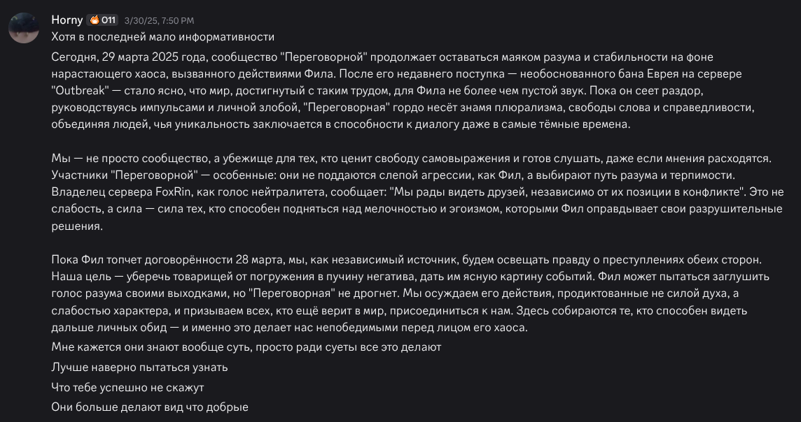

После всего этого мы решили провести ещё одно совещание, но этот раз в каналах OUTBREAK. На нём были только я, наши лояльные модераторы, комьюнити менеджер Киёми, куратор Хорни и FoxRin. Его целью было разобраться в намерениях Рины и понять, что делать дальше с этим конфликтом.

Переговоры были достаточно продуктивными, хотя их содержания не сохранилось. Однако результат был неутешительным. В процессе диалога мы пришли к тому, что Рина всё-таки считает, что с высокой вероятностью я являюсь виновным в ситуации и осуждает меня за многие действия. 

Диалог подошёл к тому, что раз уж отношения безвозвратно испорчены, и никаких зацепок для расследования у нас нет, мирно разойтись и больше не контактировать. Я собирался написать Рине прощальное письмо в честь расставания навсегда, но спокойствие прервала её внезапная выходка...

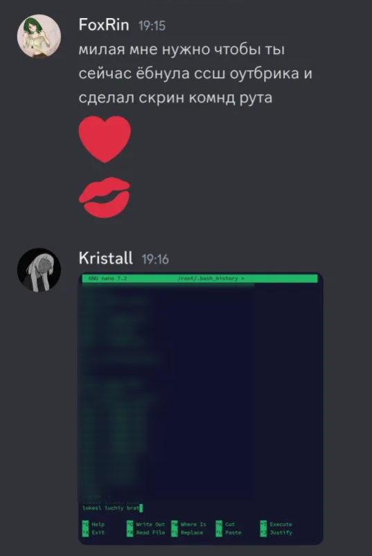
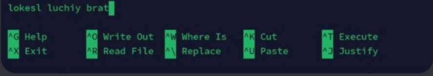

Каким-то образом они получили доступ к серверу, пароль которого вроде бы ещё нигде не мелькал. На сей раз они ничего не сделали, лишь оставив безобидное послание в терминале.

Возмущённый такой наглостью, я передумал отправлять Рине прощальное письмо.

Мы мы вышли из общего чата в приватный звонок, где в более расслабленной атмосфере, обсудили итоги.
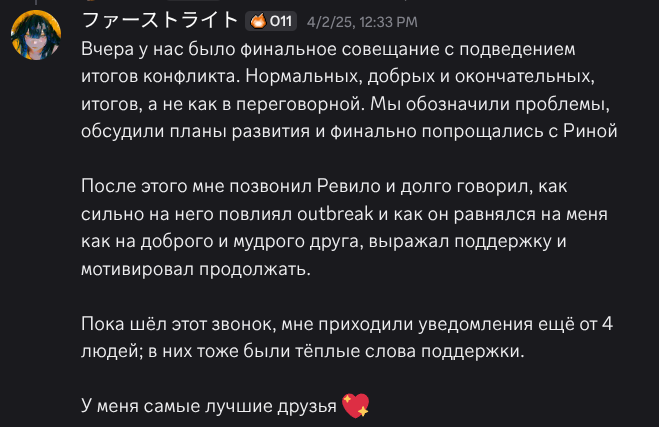

Конфликт окончально затих. Разведки всё ещё велись, а теории - строились, но больше между нами, Риной и остальной Переговорной не было никаких контактов.

### Возвращение FoxRin с финальными доказательствами

В 10-х числах апреля Рина внезапно стала появляться в комментариях в Telegram сообществе OUTBREAK, будто бы пытаясь спровоцировать беседу. Из интереса, что ещё она попытается выкинуть, я ответил ей, и мы перешли в личные сообщения.

Она начала издалека о том, как копалась во всех собранных уликах и логах, ожидая ответа от поддержки Discord. Спустя время на её запрос всё-таки ответили.

Рина извинилась за то, что обвиняла меня, и переслала данные, которые ей удалось найти.
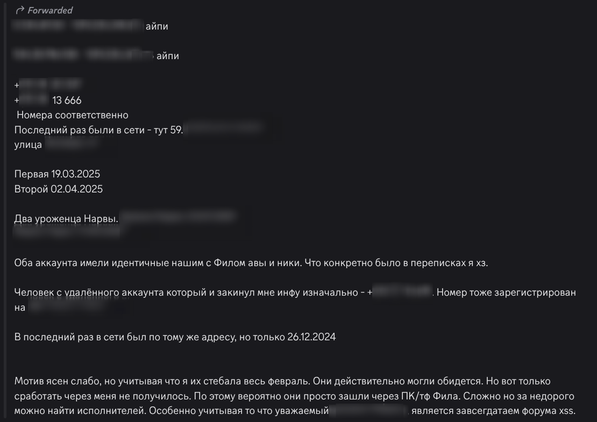

Однако официальная теория Рины не понравилась практически никому из нас. То, что какие-то левые люди устроили настолько комплексную диверсию с фейковыми переписками, для которых нужно было разбираться во внутренней кухне OUTBREAK ради какой-то мести FoxRin, выглядело абсурдным и слабым аргументом. При этом альтернативные теории также обладали немалым количеством улик в свою пользу.

### Дальнейшая судьба

После этого мы изредка общались с Риной, но из-за всего осадка от всего пройденного, восстановить прежнюю дружбу было уже невозможно. Она окончательно стала другим человеком, а не той, кого я любил. Я тоже наговорил слишком много лишнего, чтобы продолжать.

Данная статья получила своё название из-за того, как некрасиво Локес поступил с теми, с кем дружил на протяжении 4-х лет. Сначала он нагло и лживо скрыл факт того, что привёл на сервер FoxRin. Потом, в разгар конфликта с теми, кого привёл, вместо помощи, он просто исчез, а когда вернулся, был мгновенно завербован Переговорной. Несмотря на 4.5 года общения, он признал, что тот агрессивный человек на скриншотах действительно может быть мной и проигнорировал отсутствие мотивов, а также аргументы против других. Нормально разобравшись и имея давние связи с ними, он мог бы прекратить всё это парой слов, но не сделал этого, предав нас в самый тяжёлый момент.

---

Эта статья будет дорабатываться.